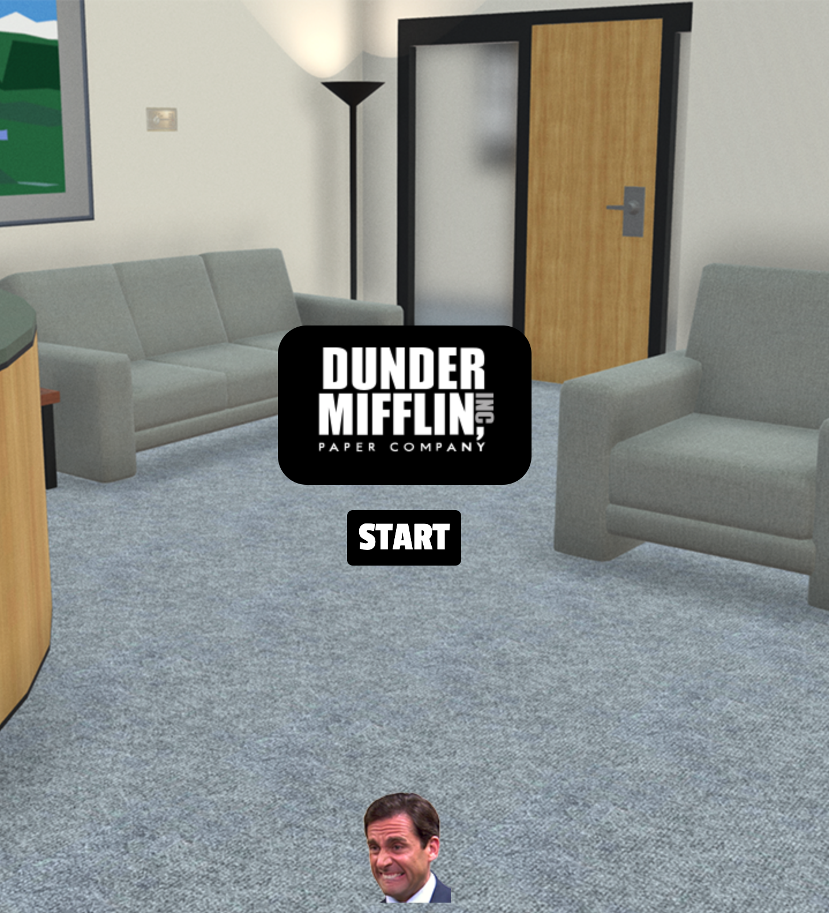

# THE ULTIMATE DUNDER MIFFLIN SHOWDOWN

## Introduction

This project was designed to practice and learn Object Oriented Programming. 

## The game

This game is called **DUNDER MIFFLIN SHOWDOWN**. In the game, you play as Michael Scott. 

You can move up and down and right and left. 

The goal of the game is to stay alive as long as possible by avoiding the Dunder Mifflin employees. 

Every time you reset the game, one of three random employees will chase you. 

**YOU CAN ALSO SHOOT PAPER TO GET RID OF THE EMPLOYEES BY PRESSING "T".**

Enjoy! 